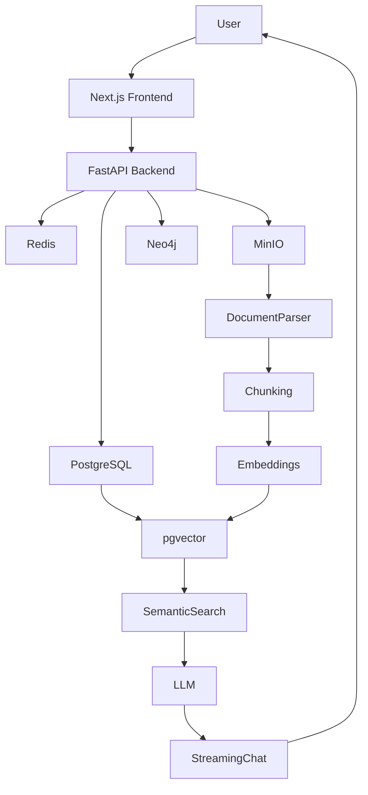
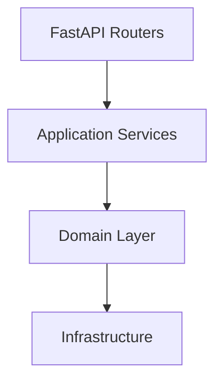
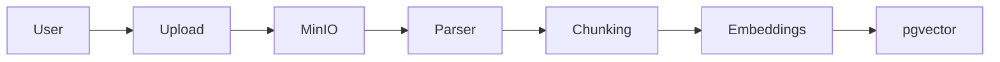
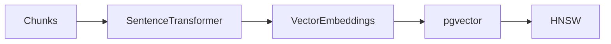
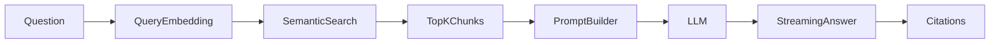
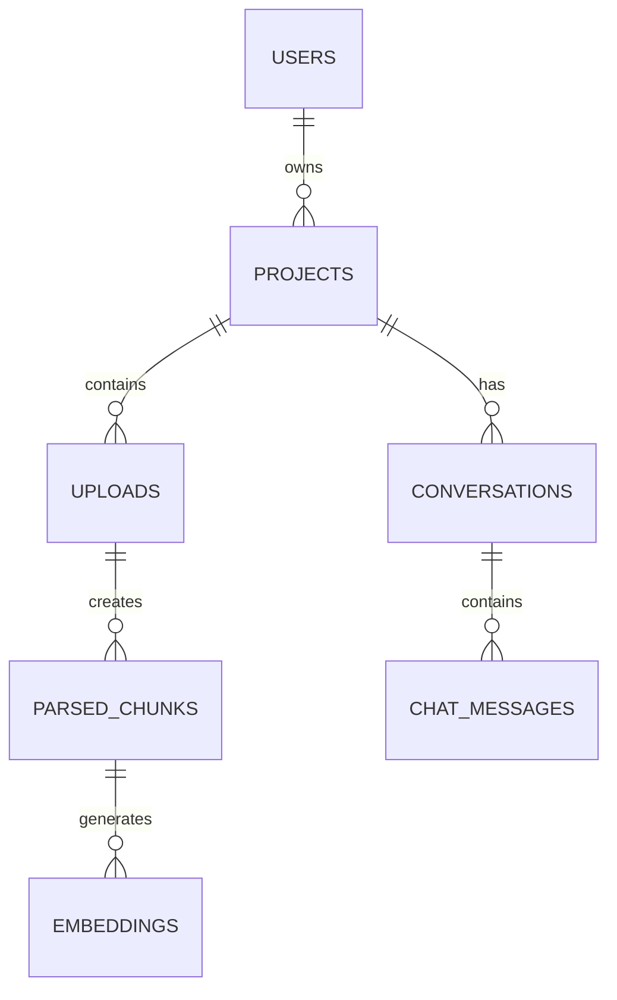

# MLCopilot Platform

<p align="center">
  <b>An Enterprise-Ready AI Knowledge Platform for Document Intelligence, Semantic Search, and Retrieval-Augmented Generation (RAG).</b>
</p>

<p align="center">
Built with <b>FastAPI • Next.js • PostgreSQL • pgvector • Redis • MinIO • Neo4j • Docker</b>
</p>

<p align="center">


</p>

---

# Table of Contents

- Overview
- Key Features
- Architecture
- AI Pipelines
- Technology Stack
- Project Structure
- API Overview
- Getting Started
- Development
- Development Progress
- Screenshots
- Roadmap
- Release History
- Author
- License

---

# Overview

MLCopilot Platform is a full-stack AI knowledge management platform that enables organizations to create intelligent workspaces powered by Retrieval-Augmented Generation (RAG).

Users can upload documents, automatically generate embeddings, perform semantic search, and chat with their private knowledge base through a modern web interface.

The platform follows **Clean Architecture**, ensuring scalability, maintainability, and clear separation of concerns across the entire system.

---

# ✨ Key Features

## 🔐 Authentication & Security

- JWT Authentication
- Refresh Token Rotation
- API Key Management
- Role-Based Access Control (RBAC)
- Protected Routes
- Swagger Authorization

---

## 📂 Project Management

- Multi-project workspaces
- Team collaboration
- Membership management
- Tenant isolation
- Ownership transfer

---

## 📚 Knowledge Base

- PDF Parsing
- DOCX Parsing
- Markdown Parsing
- TXT Parsing
- Intelligent Text Chunking
- MinIO Object Storage

---

## 🤖 AI & Retrieval

- Sentence Transformer Embeddings
- pgvector Vector Database
- HNSW Vector Indexing
- Semantic Search
- Retrieval-Augmented Generation (RAG)
- Streaming AI Responses (SSE)
- Citation Support
- Conversation Persistence

---

## ⚙️ Engineering

- Clean Architecture
- Monorepo Structure
- Docker Compose
- SQLAlchemy
- Alembic
- Pytest
- Ruff
- MyPy
- Import Linter

---

# 🏗️ System Architecture



---

# 🧠 Clean Architecture



---

# 📄 Knowledge Base Pipeline



---

# 🧩 Embedding Pipeline



---

# 💬 Retrieval-Augmented Generation Pipeline



---

# 🗄️ High-Level Database



---

# 🛠️ Technology Stack

| Layer | Technologies |
|--------|--------------|
| Frontend | Next.js, React, TypeScript, Tailwind CSS |
| Backend | FastAPI, Python |
| Database | PostgreSQL, SQLAlchemy |
| Vector Database | pgvector |
| AI | Sentence Transformers, OpenAI Provider |
| Storage | MinIO |
| Cache | Redis |
| Graph Database | Neo4j |
| DevOps | Docker, Docker Compose |
| Testing | Pytest, Ruff, MyPy, Import Linter |

---

# 📂 Project Structure

```text
MLCopilot-Platform
│
├── apps
│   ├── api
│   └── web
│
├── docs
│   ├── architecture
│   ├── api
│   ├── diagrams
│   └── images
│
├── packages
│
├── docker-compose.yml
│
└── README.md
```

---

# 🌐 API Overview

| Endpoint | Description |
|-----------|-------------|
| POST /auth/register | Register User |
| POST /auth/login | Login |
| POST /auth/logout | Logout |
| POST /projects | Create Project |
| GET /projects | List Projects |
| POST /projects/{id}/uploads | Upload Documents |
| POST /projects/{id}/search | Semantic Search |
| POST /projects/{id}/chat | RAG Chat |
| GET /api-keys | List API Keys |
| POST /api-keys | Generate API Key |

---

# 🚀 Getting Started

## Clone Repository

```bash
git clone https://github.com/Urvity03/MLCopilot-Platform.git

cd MLCopilot-Platform
```

---

## Start Entire Platform

```bash
docker compose up --build
```

---

## Backend Development

```bash
cd apps/api

uvicorn mlcopilot.main:app --reload
```

---

## Frontend Development

```bash
cd apps/web

pnpm install

pnpm dev
```

---

## API Documentation

Swagger UI

```
http://localhost:8000/api/v1/docs
```

Frontend

```
http://localhost:3000
```

---

# 💻 Development

Run code quality tools:

```bash
ruff check src tests

mypy src

pytest

lint-imports
```

---

# 📈 Development Progress

| Module | Status |
|----------|--------|
| Backend Foundation | ✅ |
| Authentication | ✅ |
| RBAC | ✅ |
| Project Management | ✅ |
| Knowledge Base | ✅ |
| Parsing | ✅ |
| Intelligent Chunking | ✅ |
| Embeddings | ✅ |
| Semantic Search | ✅ |
| RAG Backend | ✅ |
| Streaming Chat | ✅ |
| API Keys | ✅ |
| Next.js Frontend | 🚧 Active Development |
| Production UI | 🚧 |

---

# 📊 Project Highlights

- Clean Architecture
- Modular Monorepo
- JWT Authentication
- Multi-Project Workspaces
- Secure Document Uploads
- Vector Database using pgvector
- Semantic Search
- Streaming AI Chat
- Citation Support
- Dockerized Deployment
- Redis Caching
- Neo4j Integration
- MinIO Object Storage

---

# 📸 Screenshots

> Screenshots will be added after the frontend reaches feature-complete status.

Suggested screenshots:

- Dashboard
- AI Chat
- Upload Manager
- Project Workspace
- Knowledge Base
- Members
- Settings
- Mobile Dashboard
- Mobile Chat

Store screenshots inside:

```text
docs/images/
```

Example:

```markdown

```

---

# 🗺️ Roadmap

## ✅ Completed

- Backend Foundation
- Authentication
- RBAC
- Project Management
- Knowledge Base
- Document Parsing
- Intelligent Chunking
- Embedding Generation
- Semantic Search
- Retrieval-Augmented Generation
- Streaming Chat
- Citation Support

---

## 🚀 Upcoming

- Premium SaaS UI
- Multi-LLM Support
- Hybrid Search
- Knowledge Graph Expansion
- OCR Pipeline
- Experiment Tracking
- Model Registry
- Monitoring Dashboard
- CI/CD
- Kubernetes Deployment

---

# 📦 Release History

| Version | Highlights |
|----------|------------|
| **v0.1.0** | Backend Foundation, Authentication, RBAC |
| **v0.2.0** | Knowledge Base, Parsing, Chunking, Embeddings, Semantic Search |
| **v0.3.0** | RAG Backend, Streaming Chat, Citations, Conversations |
| **v0.4.0** *(In Progress)* | Next.js Frontend, Dashboard, Project Workspace, Upload Center |

---

# 👩‍💻 Author

**Urvi Tyagi**

**GitHub:** https://github.com/Urvity03

**LinkedIn:** https://www.linkedin.com/in/urvi-tyagi-17b302286/

---

# 📄 License

This project is licensed under the **MIT License**.

---

<p align="center">

⭐ If you found this project interesting, consider giving it a star!

</p>
