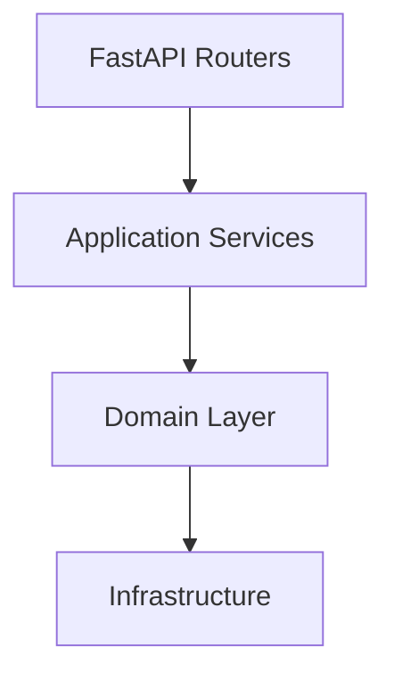
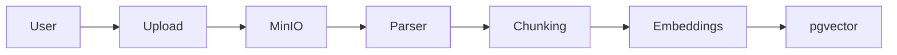
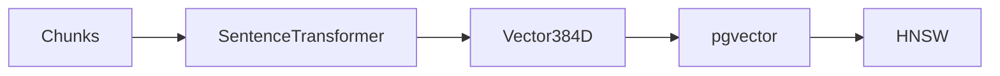
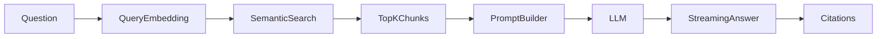
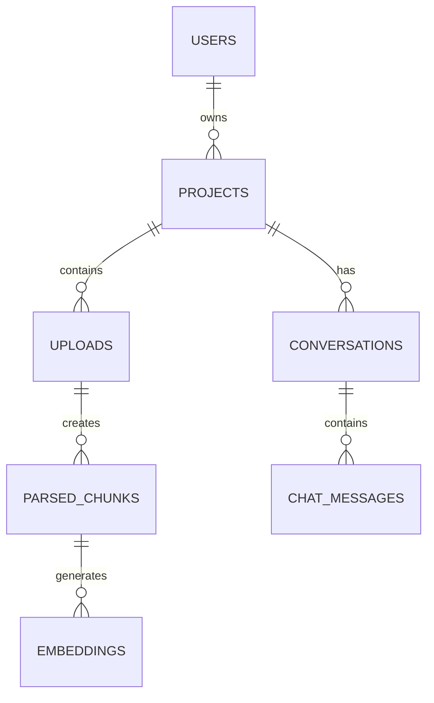

#  MLCopilot Platform

```{=html}
<p align="center">
```
`<b>`{=html}A production-ready AI Knowledge Platform built with FastAPI,
PostgreSQL, pgvector, Retrieval-Augmented Generation (RAG), and Clean
Architecture.`</b>`{=html}
```{=html}
</p>
```
```{=html}
<p align="center">
```


```{=html}
</p>
```

------------------------------------------------------------------------

#  Table of Contents

-   Overview
-   Features
-   Architecture
-   AI Pipelines
-   Tech Stack
-   Project Structure
-   API Overview
-   Getting Started
-   Development
-   Testing
-   Screenshots
-   Roadmap
-   Release History
-   Author
-   License

------------------------------------------------------------------------

#  Overview

MLCopilot Platform is a modular AI platform for managing projects,
ingesting documents, generating embeddings, performing semantic search,
and powering Retrieval-Augmented Generation (RAG) conversations.

The backend follows **Clean Architecture**, separating domain logic from
infrastructure while keeping the system scalable, testable, and easy to
extend.

------------------------------------------------------------------------

#  Features

## Platform

-   Clean Architecture
-   Monorepo
-   Docker Compose
-   Configuration management

## Authentication

-   JWT Authentication
-   Refresh Token Rotation
-   API Keys
-   RBAC
-   Swagger Authorization

## Project Management

-   Project workspaces
-   Membership management
-   Ownership transfer
-   Tenant isolation

## Knowledge Base

-   PDF parsing
-   DOCX parsing
-   Markdown parsing
-   TXT parsing
-   Intelligent chunking
-   MinIO storage

## AI

-   Sentence Transformer embeddings
-   pgvector vector storage
-   HNSW indexing
-   Semantic search
-   RAG backend
-   Conversation persistence
-   Streaming responses
-   Citation support

## Engineering

-   SQLAlchemy
-   Alembic
-   Pytest
-   Ruff
-   MyPy
-   Import Linter

------------------------------------------------------------------------

#  Clean Architecture



------------------------------------------------------------------------

#  Knowledge Base Pipeline



------------------------------------------------------------------------

#  Embedding Pipeline



------------------------------------------------------------------------

#  Retrieval-Augmented Generation



------------------------------------------------------------------------

#  High-Level Database



------------------------------------------------------------------------

#  Technology Stack

  Layer       Technologies
  ----------- -------------------------------------------------
  Backend     FastAPI, Python
  Database    PostgreSQL, SQLAlchemy
  Vector DB   pgvector
  AI          Sentence Transformers, OpenAI Provider
  Storage     MinIO
  Cache       Redis
  Graph       Neo4j
  Frontend    Next.js, TypeScript, Tailwind CSS *(Sprint 12)*
  DevOps      Docker, Docker Compose
  Testing     Pytest, Ruff, MyPy, Import Linter

------------------------------------------------------------------------

#  Project Structure

``` text
MLCopilot-Platform
├── apps
│   ├── api
│   └── web
├── docs
│   ├── architecture
│   ├── api
│   ├── diagrams
│   └── images
├── docker-compose.yml
└── README.md
```

------------------------------------------------------------------------

#  API Overview

  Endpoint                      Description
  ----------------------------- ------------------
  POST /auth/register           Register a user
  POST /auth/login              Login
  POST /projects                Create project
  POST /projects/{id}/uploads   Upload documents
  POST /projects/{id}/search    Semantic search
  POST /projects/{id}/chat      RAG chat

------------------------------------------------------------------------

#  Getting Started

``` bash
git clone https://github.com/Urvity03/MLCopilot-Platform.git
cd MLCopilot-Platform
docker compose up -d
```

Backend:

``` bash
cd apps/api
uvicorn mlcopilot.main:app --reload
```

Swagger:

    http://localhost:8000/api/v1/docs

------------------------------------------------------------------------

#  Development

``` bash
ruff check src tests
mypy src
pytest
lint-imports
```

------------------------------------------------------------------------

#  Development Progress

  Module                   Status
  ----------------------- --------
  Backend Foundation         ✅
  Authentication             ✅
  RBAC                       ✅
  Project Management         ✅
  Knowledge Base             ✅
  Parsing                    ✅
  Chunking                   ✅
  Embeddings                 ✅
  Semantic Search            ✅
  RAG Backend                ✅
  Premium SaaS Frontend      🚧

------------------------------------------------------------------------

#  Screenshots

> Screenshots will be added after Sprint 12.

Suggested screenshots:

-   Dashboard
-   Project Workspace
-   Upload Manager
-   Knowledge Base
-   AI Chat
-   Mobile View

Create this folder:

``` text
docs/images/
```

Store:

``` text
dashboard.png
chat.png
knowledge-base.png
projects.png
upload.png
mobile-dashboard.png
mobile-chat.png
```

Reference images like:

``` md

```

------------------------------------------------------------------------

#  Roadmap

## Completed

-   Backend Foundation
-   Authentication
-   RBAC
-   Project Management
-   Knowledge Base
-   Document Parsing
-   Intelligent Chunking
-   Embedding Generation
-   Semantic Search
-   Retrieval-Augmented Generation

## Upcoming

-   Premium SaaS Frontend
-   Multi-model LLM Support
-   Knowledge Graph
-   Dataset Management
-   Experiment Tracking
-   Model Registry
-   Background Workers
-   Monitoring
-   CI/CD

------------------------------------------------------------------------

#  Release History

  -----------------------------------------------------------------------
  Version                             Highlights
  ----------------------------------- -----------------------------------
  **v0.1.0**                          Backend Foundation, Authentication,
                                      RBAC

  **v0.2.0**                          Knowledge Base, Parsing, Chunking,
                                      Embeddings, Semantic Search

  **v0.3.0**                          RAG Backend, Conversations,
                                      Streaming Chat, Citations
  -----------------------------------------------------------------------

------------------------------------------------------------------------

#  Contributing

Issues, ideas, and pull requests are welcome.

Please open an issue before proposing major architectural changes.

------------------------------------------------------------------------

#  Author

**Urvi Tyagi**

-   GitHub: https://github.com/Urvity03
-   LinkedIn: https://www.linkedin.com/in/urvi-tyagi-17b302286/

------------------------------------------------------------------------

#  License

This project is licensed under the MIT License.
