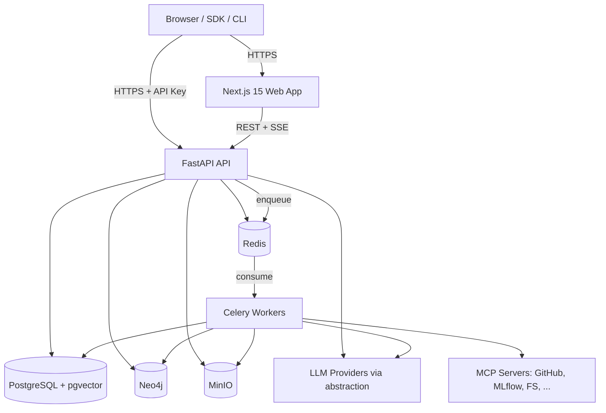

# MLCopilot — Technical Design Document

**Version:** 1.0
**Status:** Approved

This document is the entry point to the architecture. Each section links to a detailed document in `docs/architecture/`.

---

## 1. System Context

## 2. Service Topology

| Service | Technology | Responsibility |
|---|---|---|
| `web` | Next.js 15 / React 19 | Presentation; talks only to `api` |
| `api` | FastAPI (async) | HTTP + SSE, auth, domain orchestration |
| `worker` | Celery | Embeddings, parsing, graph sync, investigations, integration sync |
| `beat` | Celery Beat | Scheduled jobs (integration polling, outbox sweeper) |
| `postgres` | PostgreSQL 16 + pgvector | System of record + event store + vectors |
| `neo4j` | Neo4j 5 | Knowledge graph projection |
| `redis` | Redis 7 | Celery broker/result, rate limiting |
| `minio` | MinIO | Object storage (datasets, notebooks, papers) |

Single `docker-compose.yml` orchestrates all eight services with healthchecked startup ordering. See [21-docker.md](architecture/21-docker.md).

## 3. Foundational Decisions

| Decision | Choice | Rationale | Detail |
|---|---|---|---|
| Source of truth | PostgreSQL; Neo4j and memory are projections | One write authority; projections rebuildable from events | [08](architecture/08-event-store.md) |
| Write model | Event sourcing for significant actions + relational state tables | Auditability, memory feeds, replay; relational tables keep queries simple | [08](architecture/08-event-store.md) |
| Event delivery | Transactional outbox → Celery dispatch | No dual-write inconsistency | [13](architecture/13-event-bus.md) |
| LLM access | `LLMProvider` protocol, registry, fallback chain | Vendor independence (hard requirement) | [14](architecture/14-ai-providers.md) |
| Agent framework | LangGraph typed state graphs | Deterministic orchestration, checkpointing | [15](architecture/15-langgraph-agents.md) |
| External tools | MCP client layer + server registry | Integrations pluggable without agent changes | [16](architecture/16-mcp.md) |
| Search | pgvector HNSW + Postgres FTS + graph expansion, RRF fusion | Hybrid beats any single retriever | [19](architecture/19-search.md) |
| Extensibility | Entry-point plugin system | Core never imports plugins | [20](architecture/20-plugin-system.md) |
| Backend layering | Clean Architecture, feature-first | Long-term maintainability | [02](architecture/02-clean-architecture.md) |
| API style | REST `/api/v1`, OpenAPI-generated TS client | Typed end-to-end contract | [11](architecture/11-api-contracts.md) |
| V2/V3 gating | Capability Registry, typed `501` | Real code paths without mock logic | PRD §4 |

## 4. Cross-Cutting Concerns

- **Configuration**: `pydantic-settings`, fail-fast validation at process start with actionable error messages.
- **Errors**: single error envelope `{error: {code, message, details, request_id}}`; domain errors map to HTTP via one exception handler.
- **Logging**: `structlog` JSON, request IDs propagated to workers and agent traces. [25](architecture/25-logging.md)
- **Security**: JWT + refresh rotation, hashed API keys, per-project RBAC dependencies, slowapi rate limits, upload sanitization. [24](architecture/24-security.md)
- **Testing**: unit (pure domain + services with fakes) and integration (httpx against app with service containers); `FakeLLMProvider` for all agent tests. [27](architecture/27-testing.md)
- **Observability**: `/health/live`, `/health/ready`, Prometheus metrics, env-gated Sentry. [26](architecture/26-monitoring.md)

## 5. Key Tradeoffs

1. **Two databases (PG + Neo4j)** adds operational cost. Accepted because graph traversal ("path from paper → experiment → regression") is core product value; mitigated by making Neo4j a rebuildable projection — losing it never loses data.
2. **Event sourcing partially, not totally.** Aggregates keep relational state tables for query simplicity; events are the authoritative history for memory/investigation/timeline. Full CQRS rebuild is supported per projection, not per aggregate.
3. **Celery over ARQ/Dramatiq**: mature routing, beat scheduling, and broad operational knowledge outweigh its API age.
4. **MCP for integrations** costs an abstraction layer but makes GitHub/MLflow swappable and lets users plug in additional servers with zero agent changes.

## 6. Architecture Document Index

| # | Document |
|---|---|
| 01 | [Repository structure](architecture/01-repository-structure.md) |
| 02 | [Clean Architecture boundaries](architecture/02-clean-architecture.md) |
| 03 | [Domain model](architecture/03-domain-model.md) |
| 04 | [ER diagram](architecture/04-er-diagram.md) |
| 05 | [PostgreSQL schema](architecture/05-postgresql-schema.md) |
| 06 | [pgvector schema](architecture/06-pgvector-schema.md) |
| 07 | [Neo4j graph model](architecture/07-neo4j-graph-model.md) |
| 08 | [Event store](architecture/08-event-store.md) |
| 09 | [Authentication](architecture/09-authentication.md) |
| 10 | [RBAC](architecture/10-rbac.md) |
| 11 | [API contracts](architecture/11-api-contracts.md) |
| 12 | [Background jobs](architecture/12-background-jobs.md) |
| 13 | [Event bus](architecture/13-event-bus.md) |
| 14 | [AI providers](architecture/14-ai-providers.md) |
| 15 | [LangGraph agents](architecture/15-langgraph-agents.md) |
| 16 | [MCP](architecture/16-mcp.md) |
| 17 | [Memory](architecture/17-memory.md) |
| 18 | [Knowledge graph](architecture/18-knowledge-graph.md) |
| 19 | [Search](architecture/19-search.md) |
| 20 | [Plugin system](architecture/20-plugin-system.md) |
| 21 | [Docker](architecture/21-docker.md) |
| 22 | [Deployment](architecture/22-deployment.md) |
| 23 | [CI/CD](architecture/23-cicd.md) |
| 24 | [Security](architecture/24-security.md) |
| 25 | [Logging](architecture/25-logging.md) |
| 26 | [Monitoring](architecture/26-monitoring.md) |
| 27 | [Testing](architecture/27-testing.md) |
| 28 | [Investigation engine](architecture/28-investigation-engine.md) |
