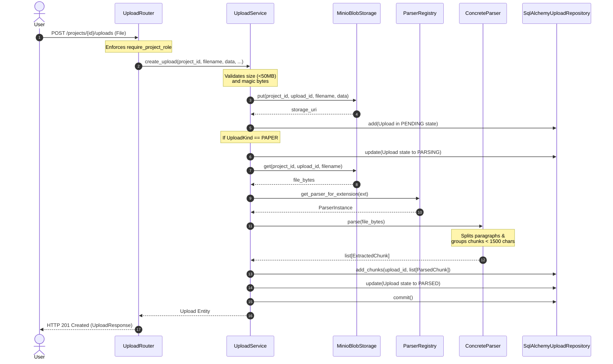

# 29 — Document Processing Pipeline

# Overview

The Document Processing Pipeline is responsible for ingesting, validating, storing, parsing, and chunking documents uploaded by users into the knowledge base of a project. 

### Purpose
To convert raw binary files (such as PDFs, Word Documents, Markdown, and plain text) into structured, clean, and granular text segments (chunks) that can be embedded and queried during semantic search.

### Responsibilities
- **File Validation**: Enforcing size limits (maximum 50MB) and checking file extensions/magic bytes for safety and compatibility.
- **Raw Object Storage**: Storing the raw binary files in MinIO Object Storage for long-term auditability and potential reprocessing.
- **Polymorphic Parsing**: Dynamically resolving and executing file-specific document parsers (PDF, DOCX, Markdown, Text).
- **Paragraph-Boundary Chunking**: Splitting raw extracted text into manageable paragraphs and aggregating them into semantic chunks of under 1500 characters.
- **State & Metadata Tracking**: Updating the database with parse status transitions (`PENDING` -> `PARSING` -> `PARSED` / `FAILED`) and chunk statistics.

### Where it fits in the architecture
The Document Processing subsystem lives at the boundary between Presentation (Upload Router), Application Use Cases (`UploadService`), and Infrastructure (MinIO Blob Storage and Parser implementations). It is part of the `uploads` feature module.

---

# Architecture

The pipeline uses a decoupled registry-based design where the application layer orchestrates state transitions while delegating file-format extraction to specialized parsers.

```
       Upload API Router (Presentation)
                    │
                    ▼
          UploadService (Application)
         /          │              \
        /           │               \
       ▼            ▼                ▼
  UploadRepo   BlobStorage     Parser Registry
  (Database)    (MinIO)              │
                                     ▼
                              DocumentParser
                            ┌───┬───┬───┬───┐
                            │   │   │   │   │
                            ▼   ▼   ▼   ▼   ▼
                           PDF DOCX MD TXT IPYNB
```

### Components and Dependency Flow
1. **`UploadRouter`** (Presentation): Validates project role scopes via dependency injection (`require_project_role`) and handles multipart request parsing.
2. **`UploadService`** (Application): Orchestrates the workflow. It manages the transactional boundary, updates the database, saves files to MinIO, and calls the parsers.
3. **`BlobStorage`** (Infrastructure Protocol): Defines the interface for uploading and retrieving raw files. Implemented by `MinioBlobStorage` using the MinIO Python client.
4. **`DocumentParser`** (Domain Protocol): Interface defining the `parse` method which accepts file bytes and returns a list of `ExtractedChunk` objects.
5. **`ParserRegistry`** (Infrastructure): Maps file extensions to their corresponding parser class implementations.
6. **`UploadRepository`** (Infrastructure Protocol): Defines database operations for `Upload` and `ParsedChunk` aggregates. Implemented concretely by `SqlAlchemyUploadRepository`.

---

# Data Flow

The document ingestion and chunking lifecycle proceeds through the following steps:

```
[Upload Request] 
      │
      ▼
1. Validation ──(Fail)──> [HTTP 422 Unprocessable]
      │
   (Pass)
      ▼
2. Save to MinIO
      │
      ▼
3. Persist Upload entity (parse_status = 'PENDING')
      │
      ▼
4. State Transition (parse_status = 'PARSING')
      │
      ▼
5. Fetch Parser & Read bytes
      │
      ▼
6. Parse content into raw paragraphs
      │
      ▼
7. Group paragraphs into chunks (< 1500 chars)
      │
      ▼
8. Persist ParsedChunks & Update state (parse_status = 'PARSED')
```

### Detailed Lifecycle Steps:
1. **Validation**: The user requests a file upload via `POST /projects/{project_id}/uploads`. The service determines file length and reads magic bytes:
   - **PDF**: Must begin with `%PDF` (magic bytes: `b"%PDF"`).
   - **DOCX**: Must begin with standard zip header (`b"PK\x03\x04"`).
   - **IPYNB**: Validated as JSON containing a `"nbformat"` key.
   - **TXT / MD**: Accepted by extension.
2. **Storage**: The file stream is uploaded to the project-isolated path in the MinIO bucket: `{project_id}/{upload_id}/{filename}`.
3. **Record Creation**: An `Upload` record is added to the database with state `parse_status=PENDING`.
4. **Text Extraction**: The service instantiates the parser retrieved from the registry. It retrieves raw file bytes from MinIO and passes them to the parser's `parse` method.
5. **Semantic Chunking**: 
   - Paragraphs are isolated by splitting text along double newlines (`\n\n`).
   - Paragraphs are aggregated into a single chunk. If adding the next paragraph exceeds **1500 characters**, the current block is saved as an `ExtractedChunk` and a new chunk begins.
6. **Database Persistence**: Chunks are mapped to `ParsedChunk` entities (capturing position index, content, and metadata) and bulk inserted into the `parsed_chunks` table.
7. **Complete Transition**: The upload record is updated to `parse_status=PARSED` and committed. If an exception occurs, the state transitions to `FAILED` and stores the traceback in metadata.

---

# Mermaid Diagram



---

# Important Classes

### `UploadService`
- **Path**: `src/mlcopilot/features/uploads/service.py`
- **Responsibility**: Orchestrator coordinating file validation, object storage uploads, state transitions, parser execution, and database commits.

### `MinioBlobStorage`
- **Path**: `src/mlcopilot/features/uploads/storage.py`
- **Responsibility**: Connects to the MinIO container to write and read raw binary file streams using bucket path isolation.

### `DocumentParser`
- **Path**: `src/mlcopilot/domain/upload.py` (Domain protocol interface)
- **Responsibility**: Defines the boundary for extracting structured chunks from document bytes.

### `TextParser`, `PdfParser`, `DocxParser`, `MarkdownParser`
- **Path**: `src/mlcopilot/infrastructure/parsers/`
- **Responsibility**: Formats-specific text extractors. For instance, `TextParser` splits on double-newlines and aggregates paragraphs into chunks under 1500 characters.

---

# Database

```
┌──────────────────────────────────────┐        ┌──────────────────────────────────────┐
│               uploads                │        │            parsed_chunks             │
├──────────────────────────────────────┤        ├──────────────────────────────────────┤
│ id (UUID, PK)                        │◄───────┤ upload_id (UUID, FK)                 │
│ project_id (UUID, FK)                │        │ id (UUID, PK)                        │
│ kind (VARCHAR)                       │        │ position (INTEGER)                   │
│ filename (VARCHAR)                   │        │ content (TEXT)                       │
│ storage_uri (VARCHAR)                │        │ metadata_ (JSONB)                    │
│ parse_status (VARCHAR)               │        │ created_at (TIMESTAMPTZ)             │
│ embedding_status (VARCHAR)           │        └──────────────────────────────────────┘
│ metadata (JSONB)                     │
│ uploaded_by (UUID, FK)               │
│ created_at (TIMESTAMPTZ)             │
└──────────────────────────────────────┘
```

- **Relationships**: One `Upload` has many `ParsedChunk` records. `ON DELETE CASCADE` is set on the foreign key constraints to ensure deletion cascades down.
- **Indexes**:
  - `uploads_project_idx` on `uploads(project_id)` (isolated lookups).
  - `parsed_chunks_upload_idx` on `parsed_chunks(upload_id)` (fast chunk retrieval during embedding generation).

---

# API Integration

- **`POST /api/v1/projects/{project_id}/uploads`**: Multipart request accepting raw document uploads. Initiates parsing, storage, and database persistence.
- **`GET /api/v1/projects/{project_id}/uploads`**: Lists upload documents and their current statuses for a project.
- **`GET /api/v1/projects/{project_id}/uploads/{upload_id}`**: Fetches parsing status details.

---

# Security

- **Authentication**: All endpoints require a valid JWT header (`Authorization: Bearer <token>`).
- **Authorization**: Project-level security is enforced at the router using `require_project_role(Role.MEMBER)` for uploads and `Role.VIEWER` for listing documents.
- **Tenant Isolation**: Direct parameter mapping limits uploads and listings strictly to the project ID specified in the API path. Attempts to upload to or query a project of which the user is not a member yield `HTTP 404 Not Found`.

---

# Design Decisions

- **Synchronous vs Asynchronous Parsing**: Document parsing and chunking run synchronously within the HTTP request transaction context.
  - *Tradeoff*: Increases the HTTP response time of uploads to a few seconds for large documents.
  - *Rationale*: Keeps state changes simple and avoids race conditions between transaction commit and background execution tasks (unlike embedding generation).
- **Paragraph-Boundary Chunking**: Splitting text along double newlines (`\n\n`) preserves textual context compared to arbitrary length character splits.
- **Size Limitation (50MB)**: Keeps container memory footprint stable and prevents server timeouts.

---

# Future Improvements

- **Asynchronous Parsing Workflows**: Move parsing to background worker queues (Celery/Redis) to handle files up to 50MB without blocking uvicorn router threads.
- **Overlap Sliding Window**: Implement overlapping character offsets to retain context across contiguous chunk segments.
