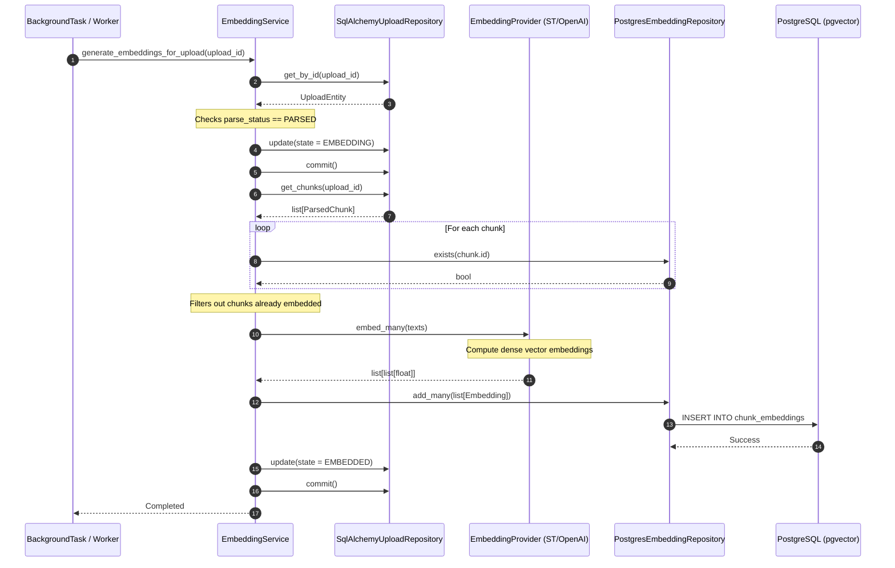

# 30 — Embedding Generation & Vector Database

# Overview

The Embedding Generation system translates text segments (document chunks) into dense mathematical vectors (embeddings) and indexes them using PostgreSQL's pgvector extension. 

### Purpose
To enable semantic search operations, allowing the Retrieval-Augmented Generation (RAG) pipeline to locate source materials matching a user's prompt by mathematical distance rather than literal keywords.

### Responsibilities
- **Lifecycle Coordination**: Shifting upload embedding status (`PENDING` -> `EMBEDDING` -> `EMBEDDED` / `FAILED`).
- **Batched Vector Inference**: Converting text chunks to vectors in parallel via the embedding provider.
- **pgvector Integration**: Storing high-dimensional vectors and querying them via cosine distance KNN search.
- **Index Management**: Building HNSW index mappings to optimize vector distance lookups.

### Where it fits in the architecture
The Embeddings subsystem is an application feature orchestrating the transition between raw document chunks and indexing. It sits between the parsing system (`UploadService`) and vector query controllers, using the `EmbeddingProvider` protocol and `PostgresEmbeddingRepository`.

---

# Architecture

The system uses a clean separation between the database storage model (pgvector) and the vector computing engine (`EmbeddingProvider`), allowing inference models to change with zero adjustments to DB code.

```
                  Upload Router
                        │
                        ▼
             Background Task (Celery)
                        │
                        ▼
            EmbeddingService (Application)
           /            │             \
          /             │              \
         ▼              ▼               ▼
   UploadRepo    EmbeddingProvider   EmbeddingRepo
   (Database)       (Inference)       (pgvector)
```

### Components
1. **`EmbeddingService`** (Application): Manages transaction boundaries, loads target document chunks, groups texts, executes batch embedding, and writes vectors.
2. **`EmbeddingProvider`** (Domain Protocol): Interface defining `embed` and `embed_many` methods. This decouples the application from vendor SDKs (e.g. SentenceTransformers, OpenAI, Cohere).
3. **`PostgresEmbeddingRepository`** (Infrastructure): Implements `add_many`, `search`, and `exists` using SQLAlchemy core maps against the `chunk_embeddings` pgvector schema.

---

# Data Flow

The database embedding flow runs through two distinct sequences: Write (Ingestion) and Read (Search).

## Ingestion Write Path
```
[Ingested Document Parsed]
            │
            ▼
1. Trigger Background task (generate_embeddings_for_upload)
            │
            ▼
2. Load parsed_chunks where chunk_id not in chunk_embeddings
            │
            ▼
3. Update state to UploadEmbeddingStatus.EMBEDDING
            │
            ▼
4. Call EmbeddingProvider.embed_many(texts) in batch
            │
            ▼
5. Bulk insert vector records to chunk_embeddings table
            │
            ▼
6. Update state to UploadEmbeddingStatus.EMBEDDED
```

## Search Query Read Path
```
[User Question] ──> EmbeddingProvider.embed(question) ──> [Query Vector]
                                                                │
                                                                ▼
                                                   PostgresEmbeddingRepository.search()
                                                                │
                                                                ▼
                                                   FTS & Cosine Similarity Join
                                                                │
                                                                ▼
                                                    list[SearchResult]
```

---

# Mermaid Diagram



---

# Important Classes

### `EmbeddingService`
- **Path**: `src/mlcopilot/features/embeddings/service.py`
- **Responsibility**: Orchestrates the write pipeline, batching text chunks, calling providers, and managing transaction scopes.

### `EmbeddingProvider`
- **Path**: `src/mlcopilot/domain/embedding.py` (Domain protocol interface)
- **Responsibility**: Interface abstraction. Implemented concretely in infrastructure (e.g. using SentenceTransformers `all-MiniLM-L6-v2` locally or OpenAI endpoints in production).

### `PostgresEmbeddingRepository`
- **Path**: `src/mlcopilot/infrastructure/db/repositories/embedding.py`
- **Responsibility**: Manages pgvector communication, handling bulk inserts and similarity queries.

---

# Database

```
┌──────────────────────────────────────┐        ┌──────────────────────────────────────┐
│            parsed_chunks             │        │           chunk_embeddings           │
├──────────────────────────────────────┤        ├──────────────────────────────────────┤
│ id (UUID, PK)                        │◄───────┤ chunk_id (UUID, FK, Unique)          │
│ upload_id (UUID, FK)                 │        │ id (UUID, PK)                        │
│ content (TEXT)                       │        │ model_name (VARCHAR)                 │
│ position (INTEGER)                   │        │ dimension (INTEGER)                  │
│ metadata_ (JSONB)                    │        │ embedding (VECTOR(384))              │
│ created_at (TIMESTAMPTZ)             │        │ created_at (TIMESTAMPTZ)             │
└──────────────────────────────────────┘        └──────────────────────────────────────┘
```

- **Data Models**:
  - `chunk_embeddings` maps directly to the `parsed_chunks` table via `chunk_id` foreign key.
  - The `embedding` column uses the `vector` type. Dimensions defaults to **384** (when using `all-MiniLM-L6-v2`) or **1024/1536** depending on config settings.
- **Indexes**:
  - `embeddings_hnsw_idx`: An HNSW vector index `USING hnsw (embedding vector_cosine_ops)` to optimize cosine similarity calculations:
    ```sql
    CREATE INDEX embeddings_hnsw_idx ON chunk_embeddings USING hnsw (embedding vector_cosine_ops);
    ```

---

# API Integration

- **`POST /api/v1/projects/{project_id}/uploads`**: Embeddings are automatically scheduled to generate in the background after the parse step completes.
- **`POST /api/v1/projects/{project_id}/embeddings/search`**: Directly queries similarity indices, returning source document mappings and score weights.

---

# Security

- **Authentication**: Access is guarded by JWT authentication checks.
- **Tenant Isolation**: Handled via SQL queries. The repository joins `ParsedChunkModel` and `UploadModel` to filter vectors strictly belonging to the specified `project_id`:
  ```python
  stmt = (
      select(...)
      .join(ParsedChunkModel, ParsedChunkModel.id == ChunkEmbeddingModel.chunk_id)
      .join(UploadModel, UploadModel.id == ParsedChunkModel.upload_id)
      .where(UploadModel.project_id == project_id)
  )
  ```
  This prevents cross-tenant retrieval.

---

# Design Decisions

- **Polymorphic vs Concrete Embedding Tables**: The database implements concrete embedding mapping tables (`chunk_embeddings`, `memory_embeddings`) instead of a single massive polymorphic entity table.
  - *Tradeoff*: Cross-entity search requires querying multiple tables.
  - *Rationale*: Enforces database relational integrity, clean foreign key cascading, and faster table scans on scoped queries.
- **Asynchronous Execution**: Ingestion pipeline schedules embedding generations on Celery background threads.
  - *Rationale*: Embedding calculations are CPU/GPU-intensive, and running them synchronously inside FastAPI routers would exhaust thread pools.
- **HNSW Indexing**: Chosen over IVFFlat index models.
  - *Rationale*: HNSW provides better recall and faster search execution times without needing a training step.

---

# Future Improvements

- **Vector Model Versioning**: Adding support for side-by-side active embedding models (e.g. migrating from MiniLM to Cohere-v3 without downtime) by checking model tags inside the `EmbeddingService`.
- **Hybrid Search Fusion**: Combine vector similarity lookups with full-text search (FTS) indices using Reciprocal Rank Fusion (RRF).
