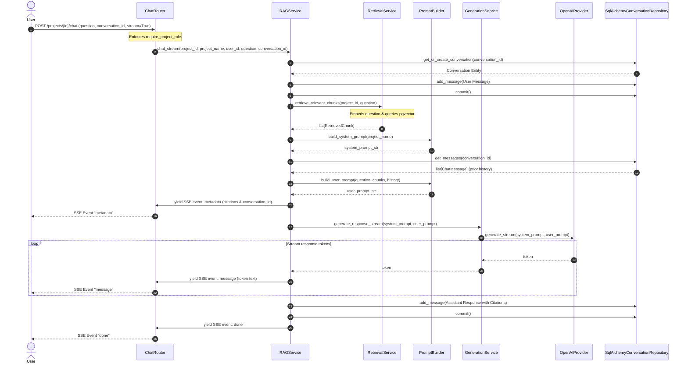

# 31 — Retrieval-Augmented Generation (RAG)

# Overview

Retrieval-Augmented Generation (RAG) is the core application logic that enables users to query their document repositories. 

### Purpose
To combine vector search (similarity query) with natural language generation, providing answers grounded in the project's knowledge base.

### Responsibilities
- **Semantic Retrieval**: Querying the database to fetch chunks matching the user's question.
- **Context Synthesis**: Formatting retrieved chunks and metadata (document filename, position) into structured prompt segments.
- **History Assembly**: Appending conversational history to maintain conversational context.
- **System Prompt Formatting**: Enforcing strict output rules, such as generating matching inline citations (e.g. `[Source ID]`) and avoiding extrapolation.
- **LLM Execution**: Orchestrating calls to the LLM (OpenAI) to generate the final response.

### Where it fits in the architecture
RAG is an orchestration flow managed by the `features/chat/` feature module. It sits at the application layer (`RAGService`), bridging the domain layer protocols (`LLMProvider`) and infrastructure (OpenAI client, pgvector databases).

---

# Architecture

RAG uses a decoupled design where prompt formatting, document retrieval, and LLM text generation are managed by dedicated services.

```
                   POST /projects/{id}/chat
                             │
                             ▼
                    RAGService (Orchestrator)
                  /     │          │        \
                 /      │          │         \
                ▼       ▼          ▼          ▼
   RetrievalService  PromptBuilder  GenerationService  ConversationRepository
      (pgvector)       (Prompts)         (LLM)              (Database)
```

### Components and Dependency Flow
1. **`RetrievalService`**: Handles semantic retrieval. It embeds the user question and queries pgvector.
2. **`PromptBuilder`**: Assembles the LLM prompts.
3. **`GenerationService`**: Orchestrates text generation.
4. **`RAGService`**: The core orchestrator. It receives requests, fetches database context, invokes services, and saves conversation state.

---

# Data Flow

The RAG workflow processes query inputs through the following lifecycle:

```
[User Question]
      │
      ▼
1. Retrieval ──> Call RetrievalService ──> [Query Vector] ──> pgvector Cosine similarity
                                                                     │
                                                                     ▼
                                                             list[RetrievedChunk]
                                                                     │
      ┌──────────────────────────────────────────────────────────────┘
      ▼
2. Prompt Building ──> Call PromptBuilder ──> Form System Prompt (Project rules)
                                          ──> Form User Prompt (Chunks + History + Query)
                                                                     │
      ┌──────────────────────────────────────────────────────────────┘
      ▼
3. Generation ──> Call GenerationService ──> OpenAI Chat Completions API
                                                             │
                                                    (Stream / Blocking)
                                                             ▼
4. Output ──> Stream SSE tokens & persist completed response to Database (with citations)
```

---

# Mermaid Diagram



---

# Important Classes

### `RAGService`
- **Path**: `src/mlcopilot/features/chat/service.py`
- **Responsibility**: Orchestrates the RAG workflow, coordinating data flow between components.

### `RetrievalService`
- **Path**: `src/mlcopilot/features/chat/retrieval.py`
- **Responsibility**: Converts questions into embeddings and queries pgvector.

### `PromptBuilder`
- **Path**: `src/mlcopilot/features/chat/prompt.py`
- **Responsibility**: Assembles system and user prompts, formatting history context and chunks.

### `GenerationService`
- **Path**: `src/mlcopilot/features/chat/generation.py`
- **Responsibility**: Manages LLM completions, wrapping blocking calls and generators.

### `OpenAIProvider`
- **Path**: `src/mlcopilot/infrastructure/llm/openai.py`
- **Responsibility**: Concrete `LLMProvider` implementation. Interacts with the OpenAI SDK.

---

# API Integration

- **`POST /api/v1/projects/{project_id}/chat`**: Evaluates conversational queries.
  - If `stream` is `True`, returns a Starlette `StreamingResponse` (media-type: `text/event-stream; charset=utf-8`).
  - If `stream` is `False`, returns a JSON object containing the complete response text and citation models.

---

# Security

- **Authorization**: All RAG endpoints require a valid JWT token. Access to a project's knowledge base is restricted to project members via `require_project_role(Role.VIEWER)`.
- **Tenant Isolation**: Queries are isolated at the retrieval step by filtering on `project_id`.
- **Conversation Ownership**: `RAGService` enforces ownership and project isolation on conversation IDs, raising a `NotFoundError` if a user attempts to access a conversation from another project or user.

---

# Design Decisions

- **Vendor Decoupling**: Application services interact with the LLM through the `LLMProvider` interface protocol.
  - *Rationale*: Allows swapping the LLM provider (e.g. from OpenAI to Anthropic or local models) without modifying the application code.
- **Strict Prompt Instructions**: System prompts instruct the LLM to use only the provided context. If the answer is missing, it must return: *"I cannot find the answer in the provided documents."*
- **Citational Grounding**: Prompts enforce inline citations (`[Source ID]`). This grounds the model's outputs and helps prevent hallucinations.

---

# Future Improvements

- **Reranking**: Integrate a cross-encoder model to re-rank the retrieved chunks before prompt building.
- **Metadata Filtering**: Support filtering source documents by metadata (e.g., date, category) during semantic retrieval.
- **Guardrails**: Implement pre-retrieval and post-generation guardrails to block unsafe queries or outputs.
