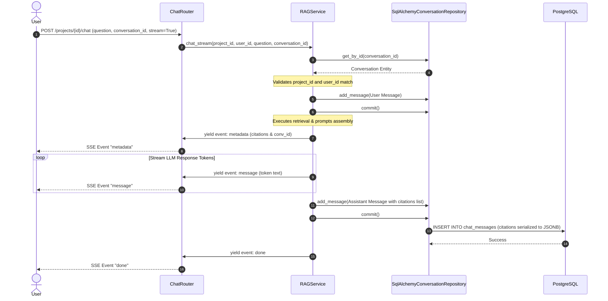

# 32 — Chat & Conversation Persistence System

# Overview

The Chat and Conversation system manages user-assistant chat sessions, handles persistent storage of message turns, and streams responses to clients.

### Purpose
To persist user query history, track model responses alongside their citation snapshots, and deliver real-time streaming responses over Server-Sent Events (SSE).

### Responsibilities
- **Session Persistence**: Managing conversation titles and storing user and assistant message records.
- **Citation Preservation**: Serializing source citation metadata alongside the assistant's responses.
- **Server-Sent Events (SSE)**: Formatting and streaming tokens as they are generated by the model.
- **Isolation Enforcement**: Restricting conversation access to authorized project members.

### Where it fits in the architecture
This subsystem sits at the boundary between Presentation (API routes, schemas, and SSE streaming) and Infrastructure (SQLAlchemy schemas and repositories), coordinated by application services.

---

# Architecture

The system uses the repository pattern to abstract conversation storage. The presentation layer streams tokens directly from the orchestrator service, preserving transactions.

```
                    FastAPI Router (Presentation)
                             │
                             ▼
                    RAGService (Application)
                   /                    \
                  ▼                      ▼
      ConversationRepository      StreamingResponse
            (Protocol)              (Event Stream)
                │
                ▼
  SqlAlchemyConversationRepository
             (Database)
```

### Components
1. **`ConversationRepository`** (Protocol): Interface for conversation and message data operations.
2. **`SqlAlchemyConversationRepository`**: Implements the repository protocol using SQLAlchemy, mapping models to entity structures.
3. **`StreamingResponse`** (Presentation): Starlette's streaming wrapper. It handles SSE event loops, flushing packets to the client.

---

# Data Flow

The conversation persistence and streaming pipeline runs through the following sequence:

```
[POST /chat Request] 
      │
      ▼
1. Fetch or create Conversation record in Database
      │
      ▼
2. Write User Message to Database
      │
      ▼
3. Retrieve Chunks & build prompt
      │
      ▼
4. Flush 'metadata' SSE event (containing conversation_id & citations list)
      │
      ▼
5. Stream tokens from LLM provider (yield Event: 'message' for each token)
      │
      ▼
6. Accumulate tokens in memory
      │
      ▼
7. Stream 'done' SSE event
      │
      ▼
8. Write completed Assistant Message and Citations to Database (Transaction commit)
```

### Detailed Lifecycle Steps:
1. **Request Ingestion**: The router receives a chat request containing a `question`, an optional `conversation_id`, and a `stream` flag.
2. **Session Retrieval**: `RAGService` calls `get_or_create_conversation`. If a `conversation_id` is provided:
   - The service fetches the conversation from the database.
   - It validates that `project_id` and `created_by` match the request context. If not, it raises a `NotFoundError`.
   - If no ID is provided, it creates a new `Conversation` with a title derived from the first 50 characters of the question.
3. **User Turn Logging**: The user's query is stored in the database.
4. **SSE Handshake**: If streaming is enabled, the router returns a `StreamingResponse` using an async generator:
   - **`metadata` event**: Emitted first, containing the `conversation_id` and source citations:
     ```text
     event: metadata
     data: {"conversation_id": "uuid", "citations": [...]}
     ```
   - **`message` events**: Emitted as tokens are received from the provider:
     ```text
     event: message
     data: {"text": " token"}
     ```
   - **`done` event**: Emitted when the stream completes:
     ```text
     event: done
     data: {"done": true}
     ```
5. **Assistant Turn Logging**: After the stream completes, the accumulated response text and citations are saved to the database.

---

# Mermaid Diagram



---

# Important Classes

### `SqlAlchemyConversationRepository`
- **Path**: `src/mlcopilot/infrastructure/db/repositories/chat.py`
- **Responsibility**: Manages conversation and message data operations, mapping database models to domain entities and serializing citations.

### `ConversationModel` & `ChatMessageModel`
- **Path**: `src/mlcopilot/infrastructure/db/models/chat.py`
- **Responsibility**: SQLAlchemy ORM models mapping `conversations` and `chat_messages` tables.

### `Conversation` & `ChatMessage`
- **Path**: `src/mlcopilot/domain/chat.py`
- **Responsibility**: Domain aggregates containing business rules and invariants.

---

# Database

```
┌──────────────────────────────────────┐        ┌──────────────────────────────────────┐
│            conversations             │        │            chat_messages             │
├──────────────────────────────────────┤        ├──────────────────────────────────────┤
│ id (UUID, PK)                        │◄───────┤ conversation_id (UUID, FK)           │
│ project_id (UUID, FK)                │        │ id (UUID, PK)                        │
│ title (TEXT)                         │        │ role (TEXT)                          │
│ created_by (UUID, FK)                │        │ content (TEXT)                       │
│ created_at (TIMESTAMPTZ)             │        │ citations (JSONB)                    │
│                                      │        │ created_at (TIMESTAMPTZ)             │
└──────────────────────────────────────┘        └──────────────────────────────────────┘
```

- **Relationships**:
  - `conversations.project_id` links to `projects.id` with `ON DELETE CASCADE`.
  - `chat_messages.conversation_id` links to `conversations.id` with `ON DELETE CASCADE`.
- **JSONB Serialization**:
  - The `citations` column in `chat_messages` stores citation metadata as a JSONB array, preserving source document snapshots directly in the message history.
- **Indexes**:
  - `chat_conversations_project_idx` on `conversations(project_id)`.
  - `chat_messages_conversation_idx` on `chat_messages(conversation_id)`.

---

# API Integration

- **`POST /api/v1/projects/{project_id}/chat`**: Evaluates chat queries and returns blocking or SSE streaming responses.
- **`GET /api/v1/projects/{project_id}/conversations`**: Lists conversations created by the current user within a project.
- **`GET /api/v1/projects/{project_id}/conversations/{conversation_id}`**: Returns the message history and citations for a conversation.
- **`DELETE /api/v1/projects/{project_id}/conversations/{conversation_id}`**: Deletes a conversation session and cascading message records.

---

# Security

- **Tenant Isolation**: Conversation operations are isolated by `project_id`. Router endpoints check project membership scopes (`Role.VIEWER` for reads, `Role.MEMBER` for writes/deletes).
- **Session Boundary Controls**: `RAGService` checks that conversation records belong to the specified project and user:
  ```python
  if conv.project_id != project_id or conv.created_by != user_id:
      raise NotFoundError("Conversation not found")
  ```
  This prevents cross-tenant access to conversation IDs.

---

# Design Decisions

- **Streaming Persistence Strategy**: Persisting assistant messages is deferred until the entire token stream completes.
  - *Tradeoff*: If the client disconnects mid-stream, the assistant's message is not saved.
  - *Rationale*: Storing incomplete responses can pollute the database. Saving the complete response guarantees clean conversation histories.
- **JSONB Citations Storage**: Chunks metadata is serialized and stored directly inside the message record.
  - *Rationale*: Avoids complex relational joins during history lookups and ensures citations remain intact even if the source document is later updated or deleted.

---

# Future Improvements

- **Auto-Summarized Titles**: Use an LLM task to generate descriptive titles for conversations after the first few turns.
- **Resume Stream Checkpoints**: Support resuming interrupted streams by using message offset indices.
