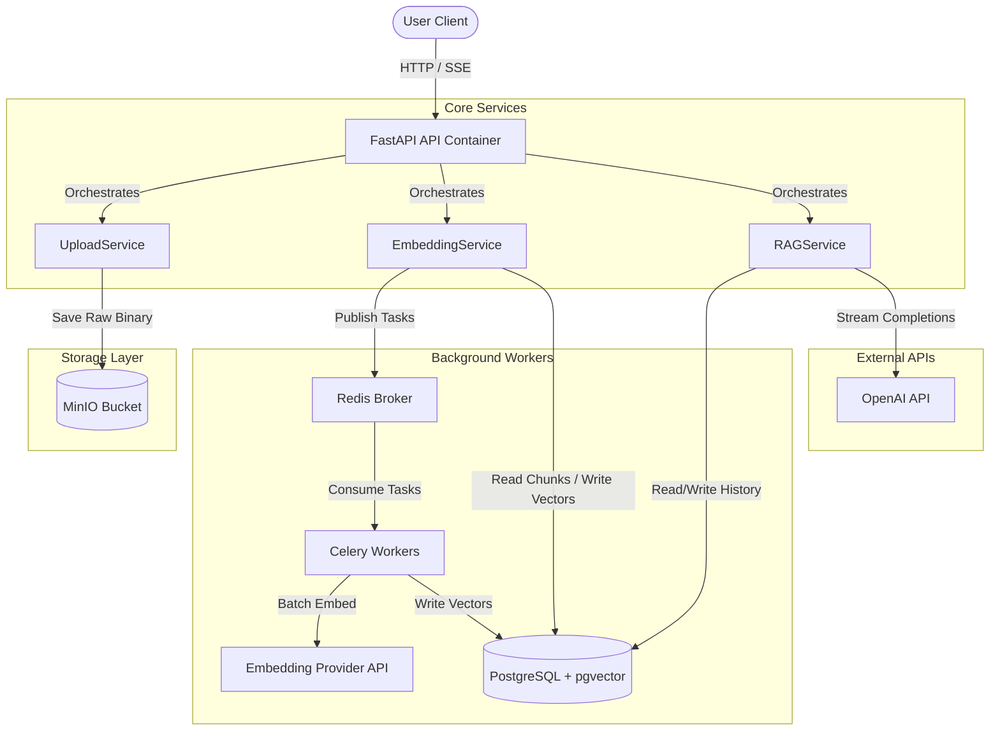

# 33 — System Architecture Overview

# Overview

This document provides a high-level overview of the MLCopilot Platform architecture, outlining how its subsystems integrate to deliver document ingestion, vector indexing, semantic search, and RAG-powered chat capabilities.

### Purpose
To define the end-to-end architecture, database schemas, background workers, and boundary rules that govern the platform.

### Responsibilities
- **Core Orchestration**: Managing user authentication, project workspaces, and RBAC rules.
- **Ingestion Pipeline**: Handling document uploads, text parsing, semantic chunking, and embedding generation.
- **RAG & Search**: Executing semantic search and generating conversational responses with grounded citations.
- **Worker Queues**: Offloading intensive tasks (like embedding inference) to background celery workers.

---

# Architecture

MLCopilot is built on a modular, containerized three-tier architecture:

```
                          ┌───────────────────────────┐
                          │     React / Next.js       │ (Presentation Layer)
                          └─────────────┬─────────────┘
                                        │ (HTTP / SSE)
                                        ▼
                          ┌───────────────────────────┐
                          │   FastAPI Backend API     │ (Application Layer)
                          └──────┬──────────────┬─────┘
                                 │              │
                    ┌────────────┘              └─────────────┐
                    ▼                                         ▼
        ┌───────────────────────┐                 ┌───────────────────────┐
        │    Celery Workers     │                 │   Databases & Storage │ (Infrastructure)
        │  (Embedding / Parse)  │                 │ (PostgreSQL, MinIO,   │
        └───────────────────────┘                 │  Redis, Neo4j)        │
                                                  └───────────────────────┘
```

### Components
1. **Presentation Layer**:
   - Next.js Web Client: Serves the user interface and chat interface.
   - FastAPI Routers: Exposes endpoints, parses requests, and enforces RBAC.
2. **Application Layer**:
   - Business services (`ProjectService`, `UploadService`, `EmbeddingService`, `RAGService`) coordinate workflows and enforce business rules.
3. **Infrastructure Layer**:
   - PostgreSQL (with pgvector): Stores relational data and handles semantic search.
   - MinIO Object Storage: Stores raw document uploads.
   - Redis: Acts as the message broker for Celery queues and caches session tokens.
   - Neo4j Graph Database: Maps connections between papers, experiments, and commits.
   - Celery: Executes background tasks like embedding generation.

---

# Data Flow

The platform coordinates two primary workflows: **Document Ingestion** and **RAG Chat**.

```
=== Document Ingestion Workflow ===
[Document Upload] ──> Save raw file to MinIO ──> Parse content into paragraphs
                                                             │
                                                             ▼
                                                    Group into chunks (<1500 chars)
                                                             │
                                                             ▼
                                                    Schedule Celery worker task
                                                             │
                                                             ▼
                                                    Batch generate embeddings
                                                             │
                                                             ▼
                                                    Insert vectors into pgvector

=== RAG Chat Workflow ===
[User Query] ──> Fetch Conversation ──> Embed query ──> Query pgvector (similarity join)
                                                                 │
                                                                 ▼
                                                        Retrieve top-k chunks
                                                                 │
                                                                 ▼
                                                        Assemble prompts with history
                                                                 │
                                                                 ▼
                                                        Stream LLM response (SSE)
                                                                 │
                                                                 ▼
                                                        Persist response and citations
```

---

# Mermaid Diagram



---

# Database Layout

The core tables in our database schema support document processing, vector indexing, and conversation tracking:

```
 ┌──────────────────────┐        ┌──────────────────────┐
 │       projects       │        │       uploads        │
 ├──────────────────────┤        ├──────────────────────┤
 │ id (UUID, PK)        │◄───────┤ project_id (UUID, FK)│
 │ name (VARCHAR)       │        │ id (UUID, PK)        │
 │ slug (VARCHAR)       │        │ parse_status         │
 └──────────────────────┘        │ embedding_status     │
                                 └──────────┬───────────┘
                                            │
                                            ▼
 ┌──────────────────────┐        ┌──────────────────────┐
 │    conversations     │        │    parsed_chunks     │
 ├──────────────────────┤        ├──────────────────────┤
 │ id (UUID, PK)        │        │ upload_id (UUID, FK) │
 │ project_id (UUID, FK)│        │ id (UUID, PK)        │
 │ title (TEXT)         │        │ content (TEXT)       │
 └──────────┬───────────┘        └──────────┬───────────┘
            │                               │
            ▼                               ▼
 ┌──────────────────────┐        ┌──────────────────────┐
 │    chat_messages     │        │   chunk_embeddings   │
 ├──────────────────────┤        ├──────────────────────┤
 │ conversation_id (FK) │        │ chunk_id (UUID, FK)  │
 │ content (TEXT)       │        │ embedding (VECTOR)   │
 │ citations (JSONB)    │        └──────────────────────┘
 └──────────────────────┘
```

- **Relational Constraints**: Deleting a project cascades down to delete its uploads, chunks, embeddings, and conversations.
- **Indexes**:
  - HNSW index on `chunk_embeddings(embedding)` for semantic search.
  - Foreign key and project ID indexes on all lookup paths to optimize query performance.

---

# Security Architecture

- **Project-Level Isolation**: Users must be members of a project to access its resources. This is enforced by `require_project_role(...)` routing dependencies.
- **Endpoint Security**: Routers validate token payloads before forwarding requests to business services.
- **Tenant Isolation**: Database repository queries filter results by `project_id`, preventing cross-tenant data leaks.
- **Session Boundaries**: `RAGService` validates conversation ownership during retrieval, preventing unauthorized access.

---

# Design Decisions

- **Clean Architecture Boundaries**: Application services communicate with infrastructure systems through protocol interfaces. This allows swapping databases, vector indexes, or LLM providers with minimal impact on core business logic.
- **Asynchronous Ingestion**: Ingestion workflows run in the background via Celery. This prevents long-running operations from blocking the web server.
- **SQL-FTS Hybrid Indexing**: Storing text content alongside vector embeddings in PostgreSQL simplifies hybrid retrieval workflows.

---

# Future Improvements

- **Knowledge Graph Integration**: Extend semantic search by fetching context from the Neo4j knowledge graph (mapping connections between concepts, code commits, and documents).
- **Caching**: Implement a Redis cache for semantic search queries to speed up response times for common questions.
